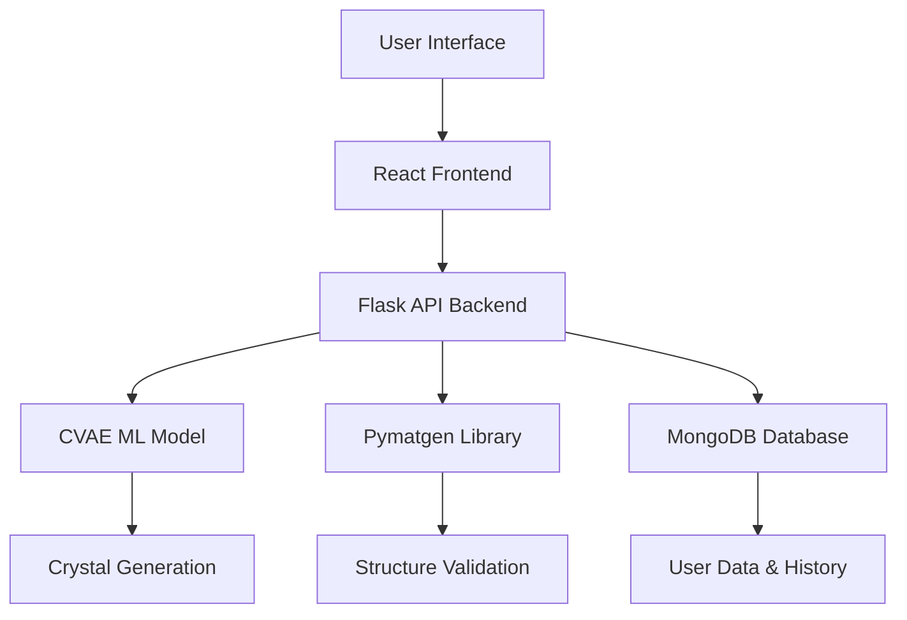
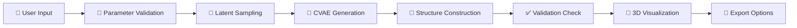

# 🧊 **BelvCrysta: AI-Powered Crystal Structure Generation Platform**

<div align="center">


*🔬 **Where Machine Learning Meets Materials Science***

</div>

---

## 📖 **About**

**BelvCrysta** is a cutting-edge AI-powered web platform that revolutionizes crystal structure generation using advanced machine learning techniques. By integrating deep learning models with materials science tools, our platform generates plausible crystal structures based on user-defined parameters such as space group, composition, and unit cell size.

🚀 **Transform your materials research with an intuitive interface** that makes complex crystallography accessible to everyone!

---

## 🌟 **Key Features**

| Feature | Description |
|---------|-------------|
| 🤖 **AI-Driven Generation** | Advanced CVAE model for intelligent crystal structure creation |
| 🎨 **Interactive UI** | Modern React-based interface with real-time visualization |
| 🔬 **Scientific Accuracy** | Built with Pymatgen and ASE for validated structures |
| 📊 **3D Visualization** | Interactive crystal structure display and analysis |
| 💾 **Multiple Formats** | Export in CIF, XYZ, and JSON formats |
| 🔐 **User Authentication** | Secure login system with history tracking |
| 📱 **Responsive Design** | Works seamlessly on desktop and mobile devices |

---

## 🏗️ **Architecture Overview**



---

## 📁 **Project Structure**

```
📦 BelvCrysta/
├── 🎨 frontend/                 # React Application
│   ├── 📁 src/
│   │   ├── 🧩 components/       # Reusable UI Components
│   │   ├── 📄 pages/           # Application Pages
│   │   │   ├── 🏠 Home.tsx
│   │   │   ├── 🔐 login.tsx
│   │   │   ├── 📝 signup.tsx
│   │   │   ├── ⚡ generate.tsx
│   │   │   └── 📚 history.tsx
│   │   ├── 🔧 utils/           # Utility Functions
│   │   └── 🎯 contexts/        # React Contexts
│   ├── 📦 package.json
│   └── ⚙️ tailwind.config.js
│
├── 🧠 backend/                  # Flask API & ML Model
│   ├── 🛤️ routes/              # API Routes
│   │   ├── 🔐 auth_routes.py
│   │   └── 💎 crystal_routes.py
│   ├── 🤖 model/               # ML Components
│   │   └── 💾 checkpoints/     # Trained Models
│   │       ├── 🏆 cvae_best.pt
│   │       └── 📈 cvae_latest.pt
│   ├── 🌐 app.py               # Flask Server
│   ├── 🏋️ train_cvae.py        # Model Training
│   └── 📋 requirements.txt     # Dependencies
│
└── 📖 README.md                # Documentation
```

---

## 🚀 **Quick Start**

### 📋 **Prerequisites**

- Python 3.8+
- Node.js 16+
- Git

### ⚙️ **Installation**

#### **1️⃣ Clone the Repository**
```bash
git clone https://github.com/NalgondaLokesh/BelvCrysta.git
cd BelvCrysta
```

#### **2️⃣ Backend Setup**
```bash
# Navigate to backend directory
cd backend

# Install Python dependencies
pip install flask flask-cors flask-bcrypt pyjwt pymongo ase pymatgen

# Start the Flask server
python app.py
```

#### **3️⃣ Frontend Setup**
```bash
# Navigate to frontend directory
cd frontend

# Install Node.js dependencies
npm install

# Start the development server
npm run dev
```

#### **4️⃣ Access the Application**
- 🌐 **Frontend**: http://localhost:5173
- 🔌 **Backend API**: http://localhost:5000

---

## 🧠 **AI Model Deep Dive**

### **Conditional Variational Autoencoder (CVAE)**

Our CVAE architecture consists of three main components:

#### **🔍 Encoder Component**
- Compresses crystal structure representations into latent vectors
- Captures essential structural features and patterns
- Enables efficient dimensionality reduction

#### **🌌 Latent Space**
- Stochastic representation allowing diverse structure generation
- Maintains learned structural patterns while enabling creativity
- Provides continuous interpolation between crystal structures

#### **🎯 Decoder Component**
- Reconstructs crystal structures from latent representations
- Incorporates conditioning parameters (space group, composition)
- Generates lattice parameters and atomic coordinates

### **📊 Model Outputs**
- 📐 **Lattice Parameters**: Unit cell dimensions and angles
- 📍 **Atomic Coordinates**: Fractional coordinates for each atom
- 🧪 **Species Assignment**: Chemical element identification

---

## 🔬 **Crystal Generation Pipeline**



### **Step-by-Step Process**

1. **🎯 Parameter Definition**
   - Space Group selection (1-230)
   - Chemical composition input
   - Number of atoms specification
   - Generation temperature control

2. **🎲 Latent Representation Sampling**
   - Random sampling from learned latent space
   - Conditioning on user parameters

3. **🤖 Model Inference**
   - Decoder generates lattice vectors
   - Predicts atomic coordinates
   - Assigns atomic species

4. **🔬 Structure Assembly**
   - Constructs complete crystal structure
   - Applies symmetry operations

5. **✅ Validation & Optimization**
   - Structural validation checks
   - Energy minimization if needed

6. **🎨 Visualization & Export**
   - Interactive 3D display
   - Multiple format export options

---

## 🎮 **User Interface Guide**

### **🏠 Home Page**
- 🎯 Platform introduction and overview
- 🔐 Authentication access
- 📊 Quick statistics and features

### **🔐 Authentication**
- **📝 Sign Up**: Create new account
- **🔑 Login**: Access existing account
- **🛡️ Secure**: JWT-based authentication

### **⚡ Generation Page**
- **🎛️ Parameter Controls**:
  - Space Group selector (1-230)
  - Element composition builder
  - Atom count slider
  - Temperature control
- **🎯 Real-time Generation**
- **📊 Progress Tracking**

### **📚 History Page**
- **📋 Previous Generations**: View all past crystal structures
- **💾 Download Options**: Export in multiple formats
- **🗑️ Management**: Delete unwanted structures

---

## 🔌 **API Documentation**

| Endpoint | Method | Description | Auth Required |
|----------|--------|-------------|---------------|
| `/api/generate` | POST | Generate crystal structure | ✅ |
| `/api/history` | GET | Retrieve user history | ✅ |
| `/api/save` | POST | Save structure to database | ✅ |
| `/api/delete` | DELETE | Remove stored structure | ✅ |
| `/api/elements` | GET | Get supported elements | ❌ |
| `/api/auth/login` | POST | User authentication | ❌ |
| `/api/auth/register` | POST | User registration | ❌ |

---

## 🧪 **Technology Stack**

### **🤖 Machine Learning**
-  **PyTorch**: Neural network implementation
-  **Pymatgen**: Crystal structure manipulation
-  **ASE**: Atomic structure operations

### **🌐 Backend**
-  **Flask**: RESTful API framework
-  **MongoDB**: Data persistence
-  **JWT**: Secure authentication

### **🎨 Frontend**
-  **React**: Component-based UI
-  **TypeScript**: Type-safe development
-  **TailwindCSS**: Modern CSS framework
-  **Vite**: Fast development tooling

---

## 📦 **Export Formats**

| Format | Extension | Use Case | Compatible Software |
|--------|-----------|----------|---------------------|
| **CIF** | `.cif` | Crystallographic standard | VESTA, Mercury, CrystalMaker |
| **XYZ** | `.xyz` | Simple coordinate format | Avogadro, Jmol, PyMOL |
| **JSON** | `.json` | Web-friendly data | Custom applications, APIs |

---

## 🎯 **Use Cases**

### **🔬 Materials Discovery**
- Generate novel crystal structures for new materials
- Explore unexplored regions of materials space
- Accelerate materials screening processes

### **📚 Educational Platform**
- Interactive learning of crystallography concepts
- Visual understanding of space groups and symmetry
- Hands-on experience with materials science

### **🏢 Computational Research**
- Generate candidate structures for DFT calculations
- Assist in structure prediction workflows
- Support high-throughput materials screening

### **🗄️ Database Expansion**
- Create diverse structure datasets
- Fill gaps in existing materials databases
- Generate training data for ML models

---

## 🚀 **Future Roadmap**

### **🎯 Short-term Goals**
- [ ] **Property Prediction**: Integrate ML models for material properties
- [ ] **Advanced Visualization**: Enhanced 3D rendering capabilities
- [ ] **Batch Processing**: Generate multiple structures simultaneously

### **🌟 Long-term Vision**
- [ ] **Expanded Element Coverage**: Support for all periodic elements
- [ ] **Integration with Databases**: Connect to Materials Project, COD
- [ ] **Collaborative Features**: Share and compare structures
- [ ] **Mobile App**: Native mobile application
- [ ] **Cloud Deployment**: Scalable cloud infrastructure

---

## 🤝 **Contributing**

We welcome contributions! Here's how you can help:

1. **🍴 Fork the repository**
2. **🌿 Create a feature branch**
3. **💻 Make your changes**
4. **✅ Add tests if applicable**
5. **📤 Submit a pull request**

---

## 📄 **License**

This project is licensed under the MIT License - see the [LICENSE](LICENSE) file for details.

---

## 🔗 **Connect With Me**

<div align="center">

[](https://github.com/NalgondaLokesh)
[](https://www.linkedin.com/in/nalgonda-lokesh)

</div>

---

## 🙏 **Acknowledgments**

- **Materials Science Community** for invaluable research and datasets
- **Open Source Contributors** who made the underlying libraries possible
- **Crystallography Researchers** advancing the field of structural science

---

<div align="center">

**⭐ If this project helped you, please give it a star!**

*🧊 Made with passion for Materials Science and AI*

</div>

