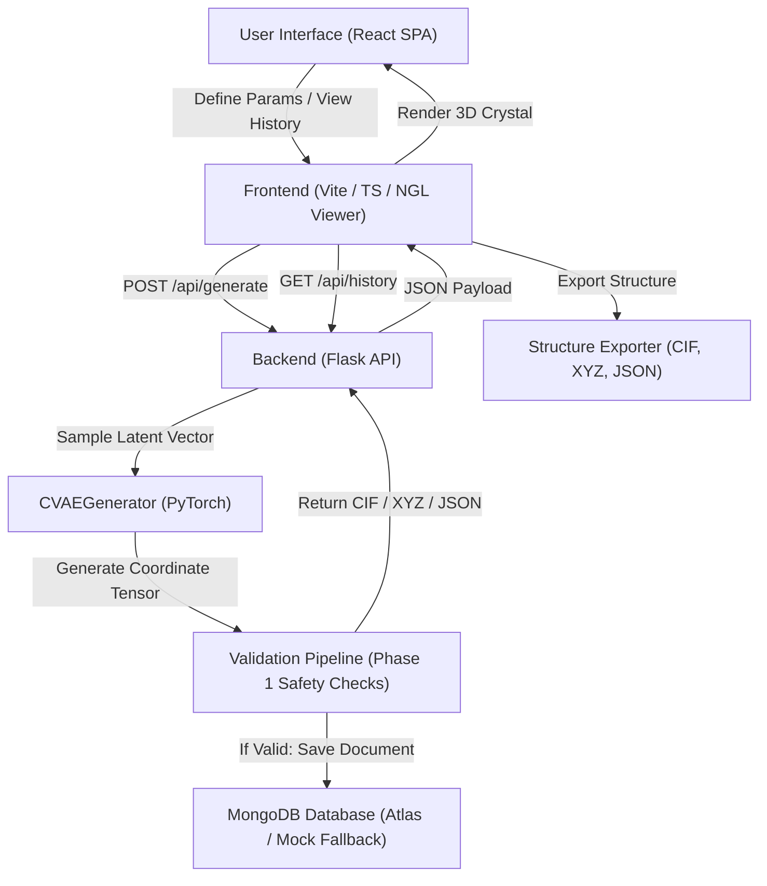
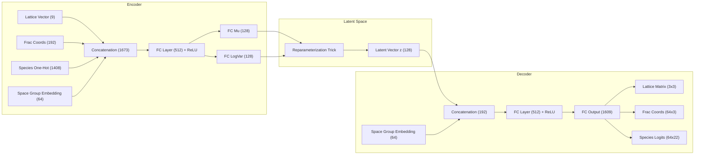
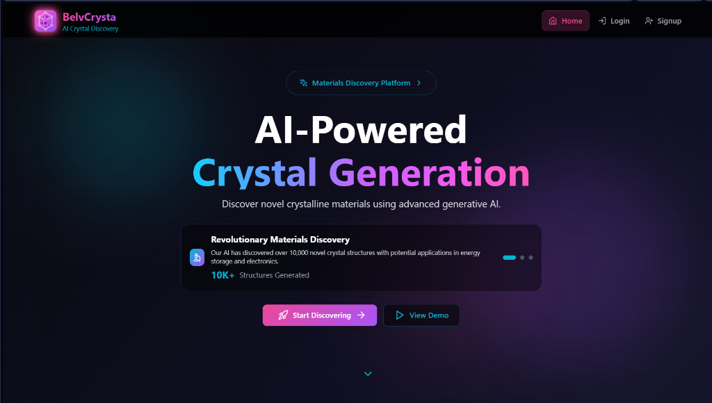
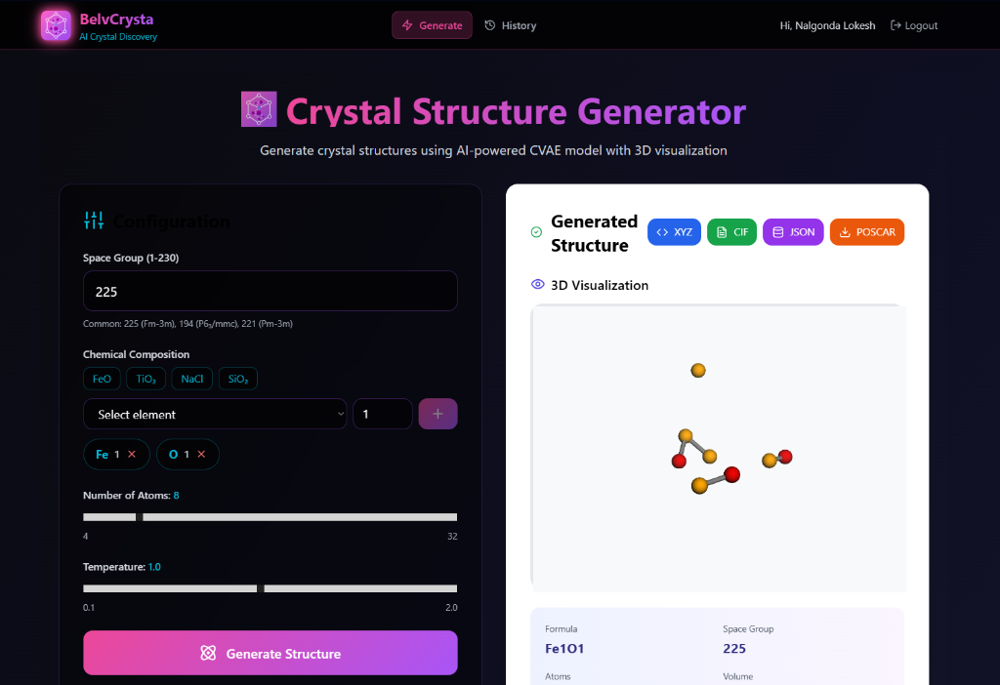
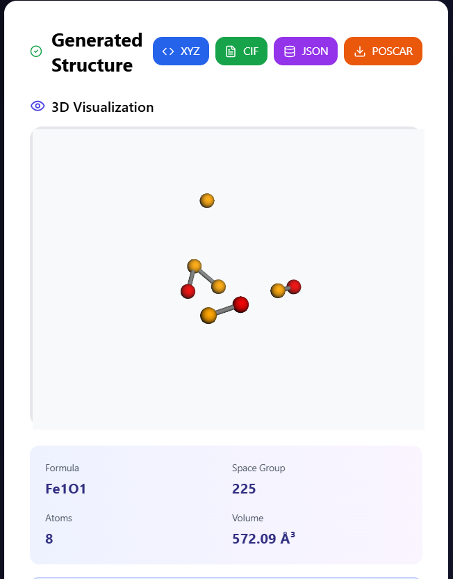
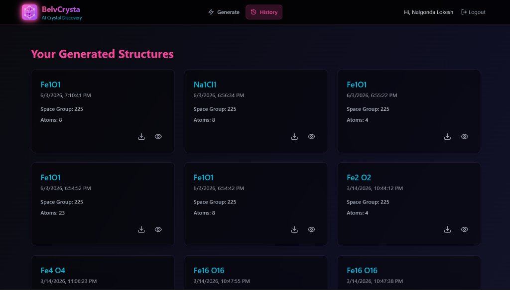

# BelvCrysta

[](https://github.com/NalgondaLokesh/BelvCrysta)
[](https://opensource.org/licenses/MIT)
[](https://www.python.org/)
[](https://react.dev/)
[](https://pytorch.org/)
[](https://pymatgen.org/)

An AI-driven crystal structure generation and visualization platform combining deep learning architectures with physical structural constraints for accelerate material design.

## Overview

BelvCrysta is a computational framework that addresses the challenge of target-driven crystal structure generation. In materials science, identifying novel crystal structures with desired properties traditionally relies on expensive high-throughput experimental screenings or high-dimensional crystal structure prediction (CSP) search algorithms. 

BelvCrysta leverages a **Conditional Variational Autoencoder (CVAE)** to map the complex, discrete, and continuous space of crystal structures (comprising unit cell vectors, fractional atomic coordinates, and chemical compositions) into a continuous latent space. By conditioning the generative process on space groups and chemical compositions, the system allows for the targeted sampling of specific crystallographic classes. Generated candidates are validated using physics-based interatomic distance checks and unit cell constraints, guaranteeing physically reasonable and chemically stable crystal structures for downstream density functional theory (DFT) calculations.

```
                  ┌──────────────────────────────────────────┐
                  │          Crystallographic Inputs         │
                  │   (Space Group, Composition, Elements)   │
                  └────────────────────┬─────────────────────┘
                                       ▼
                  ┌──────────────────────────────────────────┐
                  │       Generative Deep Learning Model     │
                  │         (Conditional VAE Decoder)        │
                  └────────────────────┬─────────────────────┘
                                       ▼
                  ┌──────────────────────────────────────────┐
                  │        Hard-Sphere Force Relaxation      │
                  │     (Physical Coordinate Correction)     │
                  └────────────────────┬─────────────────────┘
                                       ▼
                  ┌──────────────────────────────────────────┐
                  │       Phase 1 Sanity & Validation        │
                  │   (Lattice, Distance, Coordinate check)  │
                  └────────────────────┬─────────────────────┘
                                       ▼
                  ┌──────────────────────────────────────────┐
                  │     Database Storage & Visual Export     │
                  │     (CIF / XYZ Format & 3D Rendering)    │
                  └──────────────────────────────────────────┘
```

---

## Key Features

*   **Targeted Generation**: Sampling of crystals conditioned on space groups (1–230) and user-specified chemical compositions (e.g., NaCl, FeO).
*   **Deep Learning Generator**: Trained Conditional Variational Autoencoder (CVAE) architecture built in PyTorch to output lattice parameters and fractional coordinate matrices.
*   **Physics-Constrained Post-Processing**: Integrated hard-sphere repulsion relaxation loop to resolve coordinate overlaps resulting from raw model predictions.
*   **Multi-Stage Safety Validation**: Quantitative verification checks on lattice geometry, fractional coordinate bounds, and interatomic distances calculated using empirical atomic radii.
*   **Interactive 3D Rendering**: High-performance interactive visualization of crystal lattices, unit cell boundaries, and atomic positions using NGL Viewer.
*   **Export Formats**: Standard crystallographic data exports, including CIF (Crystallographic Information File), XYZ coordinates, and JSON metadata.
*   **User History Management**: Database logging of generated candidate structures mapped to secure user profiles with token-based JWT authentication.

---

## System Architecture

The application is structured as a decoupled, multi-tiered framework separating the frontend user interface, backend routing, deep learning inference, and database persistence layers.



---

## Project Structure

```
📦 BelvCrysta/
├── 🎨 frontend/                     # React Single Page Application
│   ├── 📁 src/
│   │   ├── 🧩 components/           # Routing and Layout Components
│   │   │   ├── HomeRedirect.tsx     # Session management redirect
│   │   │   ├── Layout.tsx           # Global sidebar navigation and structural frame
│   │   │   ├── ProtectedRoute.tsx   # Auth guard for generation pages
│   │   │   └── PublicRoute.tsx      # Auth guard for login/signup pages
│   │   ├── 📁 config/               # Configuration settings
│   │   ├── 🎯 contexts/             # Global Auth contexts and state management
│   │   ├── 📄 pages/               # Functional view components
│   │   │   ├── Generate.tsx         # Generator controls, validation panels, and exports
│   │   │   ├── History.tsx          # Saved structures log and visual previewers
│   │   │   ├── Home.tsx             # Interactive dashboard
│   │   │   ├── Visualization.tsx    # Dedicated 3D NGL crystal explorer
│   │   │   ├── login.tsx            # Session authorization portal
│   │   │   └── signup.tsx           # User registration portal
│   │   ├── 🔧 utils/               # Color parsing and formatting helpers
│   │   ├── App.tsx                  # Main router configuration
│   │   ├── index.css                # Global styles and tailwind utilities
│   │   └── main.tsx                 # Client entry point
│   ├── 📦 package.json              # Frontend npm dependencies and scripts
│   ├── ⚙️ tailwind.config.js         # Tailwind utility theme presets
│   ├── ⚙️ tsconfig.json              # TypeScript compilation profile
│   └── ⚙️ vite.config.ts             # Vite build pipeline setup
│
├── 🧠 backend/                      # Flask API and Deep Learning Service
│   ├── 📁 routes/                   # Module blueprints for modular routes
│   │   ├── auth_routes.py           # User management (hashed authentication)
│   │   └── crystal_routes.py        # Generation, validation, and history routes
│   ├── 📁 model/checkpoints/        # Saved weights for CVAE model
│   │   └── cvae_best.pt             # Trained model checkpoint parameters
│   ├── 🌐 app.py                   # Main Flask application entry point
│   ├── 🧪 cvae_generator.py         # PyTorch-to-Pymatgen model parser & post-processor
│   ├── 🏋️ train_cvae.py            # Standard training pipeline (128-dim latent space)
│   ├── 🏋️ train_cvae_enhanced.py   # Enhanced symmetry-aware CVAE training script
│   ├── 🏋️ quick_train_cvae.py       # Rapid integration training script (5 epochs)
│   ├── 📋 requirements.txt         # Server-side Python dependencies
│   └── 📄 .env                      # Local server configuration variables
│
├── ⚙️ Procfile                      # Production process deployment configuration
└── 📖 README.md                    # System documentation
```

---

## Technology Stack

### Frontend
*   **Core Framework**: React 18 (TypeScript)
*   **Build Pipeline**: Vite
*   **Styling**: TailwindCSS (Utility classes, customized layouts)
*   **Routing**: React Router DOM v7

### Backend
*   **Core Server**: Flask (Python 3)
*   **CORS Management**: Flask-CORS
*   **Environment Settings**: Python-dotenv
*   **Authentication**: PyJWT (JSON Web Tokens), Flask-Bcrypt (password hashing)

### Machine Learning
*   **Framework**: PyTorch
*   **Scientific Computing**: NumPy, Pandas
*   **Progress Tracking**: tqdm

### Materials Science Libraries
*   **Structure Modeling**: `pymatgen` (Python Materials Genomics)
*   **Atomic Simulations**: `ase` (Atomic Simulation Environment)

### Database
*   **Storage**: MongoDB (MongoDB Atlas cloud deployment / Local mock fallback)
*   **Driver**: PyMongo (with SRV support)

### Visualization
*   **3D Crystal Viewer**: NGL (WebGL-based molecular visualization library)

---

## Dataset and Preprocessing

BelvCrysta uses structural data derived from crystallographic representations:
1.  **Synthetic Generators**: Both `train_cvae.py` and `train_cvae_enhanced.py` contain dataset generation modules (`SyntheticCrystalDataset`) designed to generate artificial crystal structures for structural training without relying on massive external CIF databases during local testing.
2.  **Symmetry-Aware Generation**: The dataset constructor samples lattices based on selected space groups:
    *   *Cubic* ($SG \ge 195$): Enforces isotropic lattice lengths ($a = b = c$) and right angles ($\alpha = \beta = \gamma = 90^\circ$).
    *   *Tetragonal* ($75 \le SG < 195$): Restricts constraints to ($a = b \ne c$) and right angles.
    *   *Other* ($SG < 75$): Imposes fully anisotropic lattice vectors ($a \neq b \neq c$).
3.  **Feature Representation (One-Hot Encoding)**: 
    *   A set of 22 chemical elements is supported: `ELEMENTS = ['H','He','Li','Be','B','C','N','O','F','Ne','Na','Mg','Al','Si','P','S','Cl','Ar','K','Ca','Ti','Fe']`.
    *   The atomic species list is represented as a binary one-hot matrix of size $(\text{MAX\_ATOMS} \times 22)$, where $\text{MAX\_ATOMS} = 64$.
4.  **Crystallographic Features**: The preprocessing pipeline outputs a structured dictionary for the PyTorch dataloader:
    *   `lattice`: Flattened lattice representation (either a $3\times3$ lattice matrix or $3$-dimensional cell parameters).
    *   `frac`: An $(\text{MAX\_ATOMS} \times 3)$ tensor containing fractional coordinates mapping atom positions inside the unit cell.
    *   `species_oh`: Hashed representation of element assignments.
    *   `sg_idx`: Integer representation of the space group.

---

## Model Architecture

The core of BelvCrysta's generative engine is a **Conditional Variational Autoencoder (CVAE)**. Conditioning the network on the space group index ($SG$) allows the model to partition the latent space according to crystal symmetry classes.



### 1. Encoder network
The encoder compresses a given crystal structure into a distribution over a lower-dimensional latent space:
*   **Input Tensors**: Lattice matrix ($3\times3$ flattened to $9$), fractional coordinates ($\text{MAX\_ATOMS} \times 3$ flattened to $192$), and species one-hot matrix ($\text{MAX\_ATOMS} \times \text{N\_ELEM}$ flattened to $1408$).
*   **Conditioning Layer**: Space group integers pass through a `SpaceGroupEmbedding` layer (`nn.Embedding(231, 64)`) to map symbols to a continuous 64-dimensional space.
*   **Concat Dimension**: Inputs and embeddings are concatenated into a $1673$-dimensional representation.
*   **Linear Mapping**: Passes through a fully connected layer (`in_dim -> 512`) with ReLU activation.
*   **Latent Projections**: Maps to mean ($\mu$) and log variance ($\log \sigma^2$) layers of dimension $128$ each.

### 2. Latent Space
The latent variables are sampled using the reparameterization trick:
$$z = \mu + \epsilon \odot e^{\frac{1}{2} \log \sigma^2} \quad \text{where} \quad \epsilon \sim \mathcal{N}(0, I)$$
This enables backpropagation through stochastic nodes.

### 3. Decoder Network
The decoder reconstructs the crystallographic parameters from a latent coordinate $z$ and the space group condition:
*   **Input Tensors**: Latent vector $z$ ($128$) and space group embedding ($64$), concatenated to form a $192$-dimensional vector.
*   **Linear Mapping**: Passes through `Linear(192, 512)` with ReLU activation.
*   **Output Layer**: A linear projection maps features to a $1609$-dimensional output layer.
*   **Reshaping Operations**: The output tensor is partitioned and reshaped back into:
    *   Predicted Lattice Matrix: Shape $(3\times3)$.
    *   Predicted Fractional Coordinates: Shape $(\text{MAX\_ATOMS} \times 3)$.
    *   Predicted Species Logits: Shape $(\text{MAX\_ATOMS} \times \text{N\_ELEM})$.

### 4. Loss Function
The optimization objective is the Evidence Lower Bound (ELBO), consisting of reconstruction losses and a regularization term:
$$\mathcal{L}_{\text{total}} = \mathcal{L}_{\text{lattice}} + \mathcal{L}_{\text{coords}} + \mathcal{L}_{\text{species}} + \beta \mathcal{L}_{\text{KL}}$$

*   **Lattice Reconstruction Loss ($\mathcal{L}_{\text{lattice}}$)**: Mean Squared Error (MSE) between predicted and target unit-cell matrices.
*   **Coordinate Reconstruction Loss ($\mathcal{L}_{\text{coords}}$)**: MSE between predicted and target fractional atomic positions.
*   **Species Classification Loss ($\mathcal{L}_{\text{species}}$)**: Cross-entropy loss computed over atomic species logits.
*   **KL Divergence ($\mathcal{L}_{\text{KL}}$)**: Restricts the latent distribution to match a standard normal prior:
    $$\mathcal{L}_{\text{KL}} = -\frac{1}{2} \sum \left( 1 + \log \sigma^2 - \mu^2 - \sigma^2 \right)$$
    The scaling factor $\beta$ is set to $0.1$ to balance structural reconstruction and latent space coverage.

---

## Crystal Generation Workflow

```
[User Parameters] -> [Latent Vector Sample (z)] -> [Decoder Inference]
                                                            |
                                                            ▼
[Final Pymatgen Structure] <- [Validation] <- [Hard-Sphere Relaxation]
```

1.  **Input Parameters**: The user inputs space group ($SG \in [1, 230]$), composition dictionary (e.g., `{"Fe": 1, "O": 1}`), number of atoms ($N$), and temperature ($T$).
2.  **Model Inference**: A latent vector is sampled from a normal distribution scaled by temperature: $z = T \odot \mathcal{N}(0, I_d)$. The decoder reconstructs raw coordinates, lattice diagonal entries, and atomic log-probabilities.
3.  **Hard-Sphere Post-Processing**: Due to regression limits, raw predicted fractional coordinates can overlap. The generator runs a coordinate correction loop:
    *   It calculates pairwise Euclidean distances $d_{ij}$ of predicted coordinates inside the box.
    *   It looks up the minimum physical distance $D_{ij} = 0.8 \cdot (r_i + r_j)$ using atomic covalent radii.
    *   If $d_{ij} < D_{ij}$, a repulsive force moves the atoms apart.
    *   Positions are kept within unit cell limits using clipping: $[0.05 \cdot L, 0.95 \cdot L]$.
4.  **Validation**:
    *   `validate_lattice_parameters`: Ensures cell dimensions are physically reasonable ($a, b, c \in [1.0, 50.0]\text{Å}$, angles $\in (0^\circ, 180^\circ)$).
    *   `validate_coordinate_bounds`: Verifies all coordinates fall within unit-cell boundaries.
    *   `validate_interatomic_distances`: Verifies that no atomic sites have overlapping coordinates.
5.  **Visualization & Export**: Successful structures are sent to the frontend for interactive 3D WebGL rendering via NGL Viewer, and can be downloaded as CIF or XYZ files.

---

## API Documentation

### Authentication Endpoints

#### 1. User Registration
*   **Route**: `/api/auth/signup`
*   **Method**: `POST`
*   **Purpose**: Register user credentials with bcrypt password hashing.
*   **Request Body**:
    ```json
    {
      "username": "researcher1",
      "email": "user@domain.com",
      "password": "secure_password"
    }
    ```
*   **Response Format (`201 Created`)**:
    ```json
    {
      "message": "User created successfully!"
    }
    ```

#### 2. User Login
*   **Route**: `/api/auth/login`
*   **Method**: `POST`
*   **Purpose**: Verify credentials and generate a JSON Web Token (JWT).
*   **Request Body**:
    ```json
    {
      "email": "user@domain.com",
      "password": "secure_password"
    }
    ```
*   **Response Format (`200 OK`)**:
    ```json
    {
      "success": true,
      "token": "eyJhbGciOiJIUzI1NiIsIn...",
      "username": "researcher1"
    }
    ```

---

### Crystal Structure Endpoints

#### 3. List Supported Elements
*   **Route**: `/api/elements`
*   **Method**: `GET`
*   **Purpose**: Get chemical elements supported by the model training dictionary.
*   **Response Format (`200 OK`)**:
    ```json
    {
      "success": true,
      "elements": ["H", "He", "Li", "Be", "B", "C", "N", "O", "F", "Ne", "Na", "Mg", "Al", "Si", "P", "S", "Cl", "Ar", "K", "Ca", "Ti", "Fe"]
    }
    ```

#### 4. Generate Structure
*   **Route**: `/api/generate`
*   **Method**: `POST`
*   **Headers**: `Authorization: Bearer <JWT_TOKEN>`
*   **Purpose**: Generate, post-process, and validate a crystal structure using the CVAE model.
*   **Request Body**:
    ```json
    {
      "composition": {"Fe": 1, "O": 1},
      "spacegroup": 225,
      "num_atoms": 8,
      "temperature": 0.8
    }
    ```
*   **Response Format (`200 OK`)**:
    ```json
    {
      "success": true,
      "message": "Structure generated successfully",
      "model_id": "64c8f...",
      "formula": "Fe4O4",
      "spacegroup": 225,
      "lattice_parameters": {
        "a": 6.2, "b": 6.2, "c": 6.2,
        "alpha": 90.0, "beta": 90.0, "gamma": 90.0,
        "volume": 238.3
      },
      "atoms": [
        {"element": "Fe", "position": [0.31, 0.31, 0.31], "frac_coords": [0.05, 0.05, 0.05]},
        ...
      ],
      "xyz_data": "8\nFe4O4\nFe 0.310 0.310 0.310...",
      "cif_data": "data_Fe4O4\n_cell_length_a 6.200...",
      "validation_report": {
        "overall_valid": true,
        "critical_errors": [],
        "warnings": []
      }
    }
    ```

#### 5. Fetch User Generation History
*   **Route**: `/api/history`
*   **Method**: `GET`
*   **Query Parameters**: `?token=<JWT_TOKEN>`
*   **Purpose**: Get all crystal structures generated by the authenticated user.
*   **Response Format (`200 OK`)**:
    ```json
    {
      "history": [
        {
          "_id": "64c8f...",
          "formula": "Fe4O4",
          "spacegroup": 225,
          "created_at": "2026-06-03T13:30:00Z",
          "lattice_parameters": { "a": 6.2, "b": 6.2, "c": 6.2, "alpha": 90, "beta": 90, "gamma": 90, "volume": 238.3 },
          "atoms": [...]
        }
      ]
    }
    ```

#### 6. Fetch Specific Structure Detail
*   **Route**: `/api/structure/<structure_id>`
*   **Method**: `GET`
*   **Query Parameters**: `?token=<JWT_TOKEN>`
*   **Purpose**: Get detailed coordinate data for a specific generated structure.
*   **Response Format (`200 OK`)**:
    ```json
    {
      "success": true,
      "structure": {
        "_id": "64c8f...",
        "formula": "Fe4O4",
        "spacegroup": 225,
        "lattice_parameters": { "a": 6.2, "b": 6.2, "c": 6.2, "alpha": 90, "beta": 90, "gamma": 90, "volume": 238.3 },
        "atoms": [...],
        "xyz_data": "...",
        "cif_data": "...",
        "created_at": "..."
      }
    }
    ```

---

## Screenshots

### Home Page


### Generation Page


### Generated Crystal Structure


### History Page


---

## Installation

### Prerequisites
*   Node.js (v16.0.0 or higher)
*   Python (v3.8 or higher)
*   MongoDB Instance (or Atlas URI)

### Setup Steps

#### 1. Clone the Repository
```bash
git clone https://github.com/NalgondaLokesh/BelvCrysta.git
cd BelvCrysta
```

#### 2. Backend Installation and Execution
Configure the environment variables by creating a `backend/.env` file:
```env
SECRET_KEY=your_jwt_signature_key
MONGO_URI=mongodb+srv://<username>:<password>@cluster.mongodb.net/crystalgen_db
FLASK_DEBUG=True
PORT=5000
```

Install python requirements and start the Flask server:
```bash
cd backend
pip install -r requirements.txt

# Run the backend Flask server
python app.py
```

#### 3. Frontend Installation and Execution
Install npm dependencies and launch the Vite client dev server:
```bash
cd ../frontend
npm install

# Start the Vite development build
npm run dev
```

The application will be accessible at:
*   Frontend Dev URL: `http://localhost:5173`
*   Backend Endpoint: `http://localhost:5000`

---

## Results

### Model Evaluation Methodology

Since the model is trained on custom synthetic datasets, performance is evaluated by checking how well the reconstructed structures match physical crystals:

| Evaluation Metric | Target Objective | Assessment Tool |
| :--- | :--- | :--- |
| **Lattice Reconstruction Loss** | Minimize MSE between predicted and target parameters | L2-Norm / MSE |
| **Coordinate Deviation** | Minimize coordinate discrepancy, keeping predictions mapped in $[0, 1]$ | Mean Squared Error |
| **Species Categorization Accuracy** | Maximize classification accuracy across element types | Cross Entropy |
| **Structural Validity Rate** | Percentage of generations passing Phase 1 safety constraints | Empirical Distance Filter |

You can train and evaluate a model locally by running:
```bash
cd backend
python train_cvae.py
```
To run a fast test to verify the training and checkpoint loop:
```bash
python quick_train_cvae.py
```

---

## Research Contributions

BelvCrysta introduces several workflows designed for materials science research:
*   **Target-Conditioned Structural Sampling**: Rather than training a generic generator, conditioning the encoder and decoder on space group indices enforces symmetry considerations directly in the latent representation.
*   **Hybrid Generative-Numerical Generator**: Recognizing that deep generative networks often fail to capture hard spatial boundaries (predicting overlapping atoms), the system pairs a neural network with a hard-sphere repulsion relaxation loop. This ensures that the generated coordinates are physically plausible.
*   **Empirical Screening Filters**: Integrates crystallography checks directly into the API flow, screening out unstable structures prior to saving, which helps save computational budget during downstream DFT calculations.

---

## Future Work

*   **Graph Neural Networks (GNNs)**: Integrate crystal graph architectures (such as CGCNN or MEGNet) into the encoder and decoder to better capture localized atomic bonds.
*   **Diffusion Models**: Implement Denoising Diffusion Probabilistic Models (DDPM) to iteratively refine coordinates, replacing the hard-sphere repulsion loop with learnable force-field dynamics.
*   **Materials Project API Integration**: Support training on real experimental and calculated structures retrieved via the Materials Project API to transition from synthetic training data to real physical material systems.
*   **Automated DFT Job Submission**: Integrate the pipeline with tools like Atomate or Custodian to automatically submit valid structures to remote clusters for VASP or Quantum ESPRESSO density functional theory calculations.

---

## License

Distributed under the MIT License. See [LICENSE](LICENSE) for more details.

---

## Authors

*   **Nalgonda Lokesh** - *Machine Learning & Materials Informatics* - [GitHub Profile](https://github.com/NalgondaLokesh)
